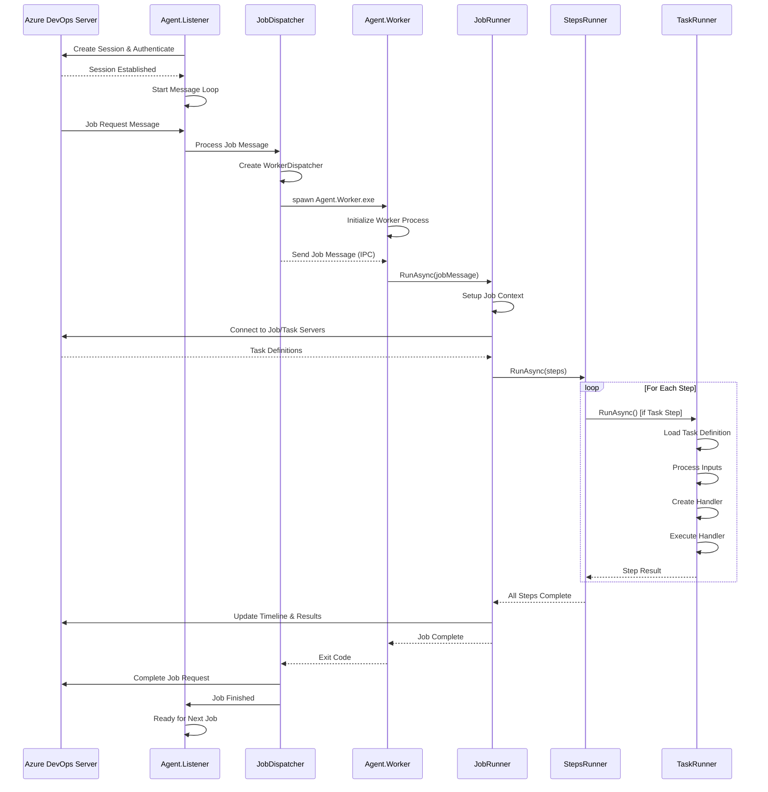
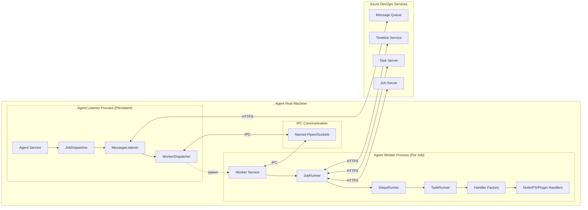
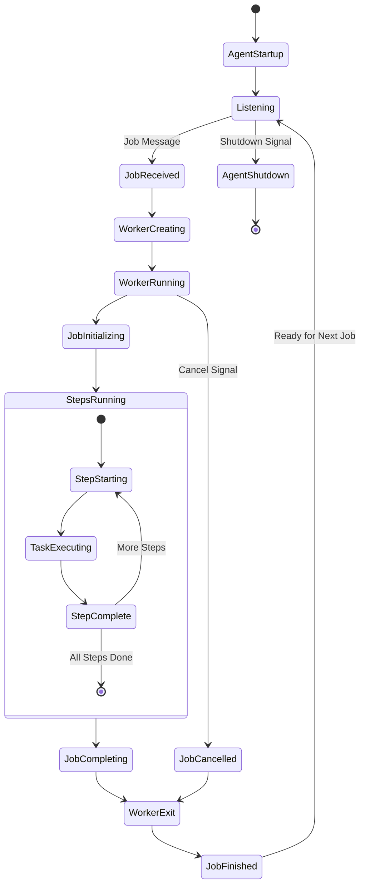

# Azure DevOps Agent Lifecycle Flowchart

```mermaid
graph TD
    %% Agent Startup
    A[Agent.Listener Startup] --> B[Program.Main]
    B --> C[MainAsync]
    C --> D[HostContext Creation]
    D --> E[Command Parsing]
    E --> F[Agent.ExecuteCommand]
    
    %% Configuration and Listening
    F --> G[Configuration Loading]
    G --> H[Agent.RunAsync]
    H --> I[MessageListener.CreateSessionAsync]
    I --> J[Server Connection & Auth]
    J --> K[JobDispatcher Initialization]
    K --> L[Message Polling Loop]
    
    %% Job Reception
    L --> M{Message Type?}
    M -->|AgentJobRequest| N[Job Message Processing]
    M -->|JobCancel| O[Job Cancellation]
    M -->|AgentRefresh| P[Agent Update]
    M -->|Metadata| Q[Metadata Update]
    
    %% Job Dispatch
    N --> R[JobDispatcher.Run]
    R --> S[WorkerDispatcher Creation]
    S --> T[JobDispatcher.RunAsync]
    
    %% Worker Process Creation
    T --> U[Previous Job Cleanup]
    U --> V[Job Lock Renewal Start]
    V --> W[Process Channel Setup]
    W --> X[Worker Process Creation]
    X --> Y[Agent.Worker.exe spawnclient]
    
    %% Worker Initialization
    Y --> Z[Worker Program.Main]
    Z --> AA[Worker.RunAsync]
    AA --> BB[Channel.StartClient]
    BB --> CC[Receive Job Message]
    CC --> DD[Secret Masker Init]
    DD --> EE[JobRunner.RunAsync]
    
    %% Job Context Setup
    EE --> FF[Job Validation]
    FF --> GG[Server Connections]
    GG --> HH[ExecutionContext Creation]
    HH --> II[Variable Expansion]
    II --> JJ[Work Directory Setup]
    JJ --> KK[Job Extension Init]
    
    %% Step Processing
    KK --> LL[JobExtension.InitializeJob]
    LL --> MM[Step List Creation]
    MM --> NN[StepsRunner.RunAsync]
    NN --> OO{More Steps?}
    
    %% Individual Step Execution
    OO -->|Yes| PP[Step Validation]
    PP --> QQ[ExecutionContext.Start]
    QQ --> RR[Variable Expansion]
    RR --> SS[Condition Evaluation]
    SS --> TT{Step Enabled?}
    
    %% Task Execution
    TT -->|Yes| UU[TaskRunner.RunAsync]
    UU --> VV[Task Definition Loading]
    VV --> WW[Handler Selection]
    WW --> XX[Input Processing Pipeline]
    XX --> YY[LoadDefaultInputs]
    YY --> ZZ[Instance Input Merging]
    ZZ --> AAA[Variable Expansion]
    AAA --> BBB[Environment Setup]
    BBB --> CCC[Handler Creation]
    CCC --> DDD[Handler.RunAsync]
    
    %% Handler Execution
    DDD --> EEE{Handler Type?}
    EEE -->|Node| FFF[Node.js Execution]
    EEE -->|PowerShell| GGG[PowerShell Execution]
    EEE -->|Plugin| HHH[Plugin Host Execution]
    EEE -->|Process| III[External Process Execution]
    
    %% Step Completion
    FFF --> JJJ[Step Result]
    GGG --> JJJ
    HHH --> JJJ
    III --> JJJ
    
    JJJ --> KKK[Exception Handling]
    KKK --> LLL[Result Determination]
    LLL --> MMM[Async Command Wait]
    MMM --> OO
    
    %% Job Completion
    OO -->|No| NNN[Job Finalization]
    TT -->|No| OO
    
    NNN --> OOO[Job Extension Finalize]
    OOO --> PPP[Support Log Upload]
    PPP --> QQQ[Timeline Updates]
    QQQ --> RRR[Job Result Calculation]
    RRR --> SSS[Worker Process Exit]
    
    %% Cleanup and Next Job
    SSS --> TTT[JobDispatcher Cleanup]
    TTT --> UUU[Process Result Validation]
    UUU --> VVV[Job Request Completion]
    VVV --> WWW[Lock Renewal Cancel]
    WWW --> XXX[Timeline Record Update]
    XXX --> YYY[Message Deletion]
    YYY --> L
    
    %% Error Paths
    O --> L
    P --> L
    Q --> L
    
    %% Styling
    classDef processClass fill:#e1f5fe,stroke:#01579b,stroke-width:2px
    classDef decisionClass fill:#f3e5f5,stroke:#4a148c,stroke-width:2px
    classDef taskClass fill:#e8f5e8,stroke:#1b5e20,stroke-width:2px
    classDef workerClass fill:#fff3e0,stroke:#e65100,stroke-width:2px
    
    class A,B,C,Y,Z,AA processClass
    class M,OO,TT,EEE decisionClass
    class UU,VV,WW,XX,YY,ZZ,AAA,BBB,CCC,DDD taskClass
    class FF,GG,HH,II,JJ,KK,LL,MM,NN workerClass
```

## Component Interaction Diagram

```mermaid
sequenceDiagram
    participant AzDO as Azure DevOps Server
    participant AL as Agent.Listener
    participant JD as JobDispatcher
    participant AW as Agent.Worker
    participant JR as JobRunner
    participant SR as StepsRunner
    participant TR as TaskRunner
    
    %% Initialization
    AL->>AzDO: Create Session & Authenticate
    AzDO-->>AL: Session Established
    AL->>AL: Start Message Loop
    
    %% Job Reception
    AzDO->>AL: Job Request Message
    AL->>JD: Process Job Message
    JD->>JD: Create WorkerDispatcher
    
    %% Worker Creation
    JD->>AW: spawn Agent.Worker.exe
    AW->>AW: Initialize Worker Process
    JD-->>AW: Send Job Message (IPC)
    
    %% Job Execution
    AW->>JR: RunAsync(jobMessage)
    JR->>JR: Setup Job Context
    JR->>AzDO: Connect to Job/Task Servers
    AzDO-->>JR: Task Definitions
    
    %% Step Processing
    JR->>SR: RunAsync(steps)
    loop For Each Step
        SR->>TR: RunAsync() [if Task Step]
        TR->>TR: Load Task Definition
        TR->>TR: Process Inputs
        TR->>TR: Create Handler
        TR->>TR: Execute Handler
        TR-->>SR: Step Result
    end
    
    %% Completion
    SR-->>JR: All Steps Complete
    JR->>AzDO: Update Timeline & Results
    JR-->>AW: Job Complete
    AW-->>JD: Exit Code
    JD->>AzDO: Complete Job Request
    JD->>AL: Job Finished
    AL->>AL: Ready for Next Job
```

## Process Architecture Diagram

```mermaid
graph LR
    subgraph "Agent Host Machine"
        subgraph "Agent.Listener Process (Persistent)"
            A[Agent Service] --> B[JobDispatcher]
            B --> C[MessageListener]
            C --> D[WorkerDispatcher]
        end
        
        subgraph "Agent.Worker Process (Per Job)"
            E[Worker Service] --> F[JobRunner]
            F --> G[StepsRunner]
            G --> H[TaskRunner]
            H --> I[Handler Factory]
            I --> J[Node/PS/Plugin Handlers]
        end
        
        subgraph "IPC Communication"
            K[Named Pipes/Sockets]
        end
        
        D -.->|spawn| E
        D <-->|IPC| K
        E <-->|IPC| K
    end
    
    subgraph "Azure DevOps Services"
        L[Message Queue]
        M[Job Server]
        N[Task Server]
        O[Timeline Service]
    end
    
    C <-->|HTTPS| L
    F <-->|HTTPS| M
    F <-->|HTTPS| N
    F <-->|HTTPS| O
```

## State Transitions

```mermaid
stateDiagram-v2
    [*] --> AgentStartup
    AgentStartup --> Listening
    
    Listening --> JobReceived: Job Message
    JobReceived --> WorkerCreating
    WorkerCreating --> WorkerRunning
    
    WorkerRunning --> JobInitializing
    JobInitializing --> StepsRunning
    
    state StepsRunning {
        [*] --> StepStarting
        StepStarting --> TaskExecuting
        TaskExecuting --> StepComplete
        StepComplete --> StepStarting: More Steps
        StepComplete --> [*]: All Steps Done
    }
    
    StepsRunning --> JobCompleting
    JobCompleting --> WorkerExit
    WorkerExit --> JobFinished
    JobFinished --> Listening: Ready for Next Job
    
    Listening --> AgentShutdown: Shutdown Signal
    WorkerRunning --> JobCancelled: Cancel Signal
    JobCancelled --> WorkerExit
    
    AgentShutdown --> [*]
```
