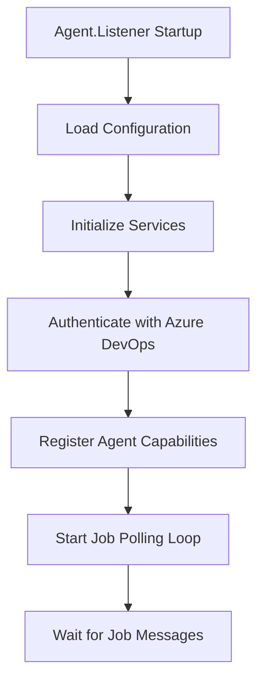
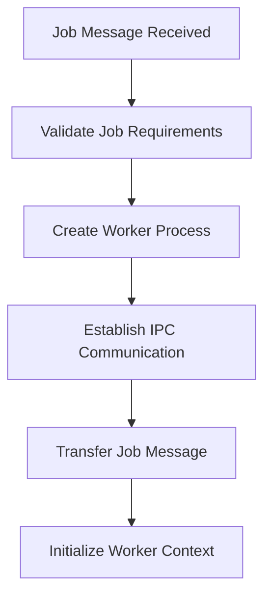
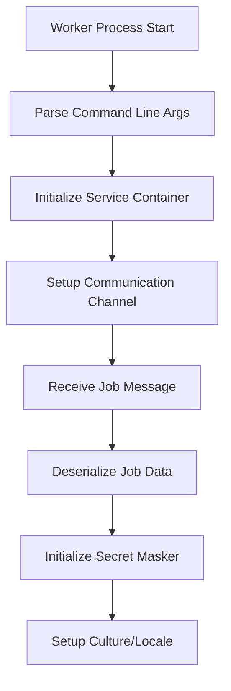
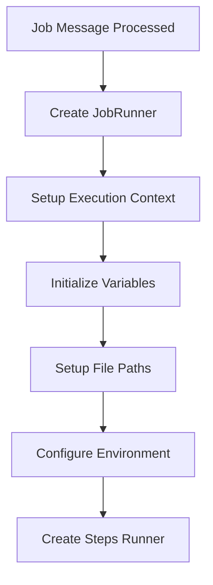
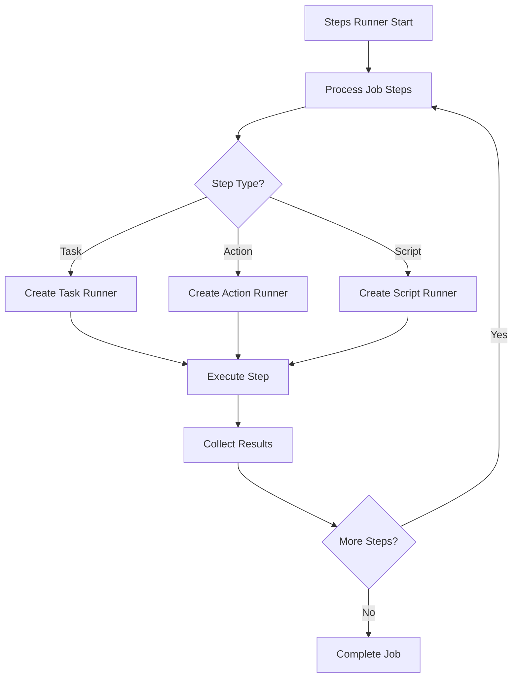
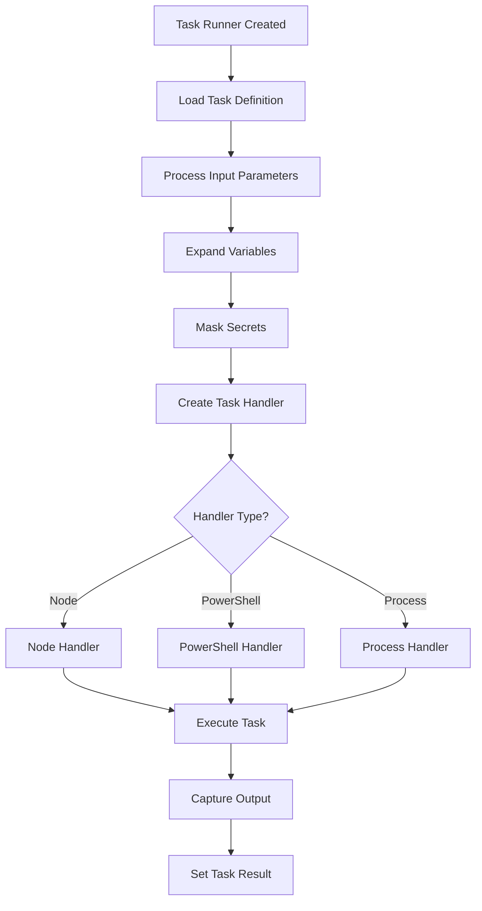
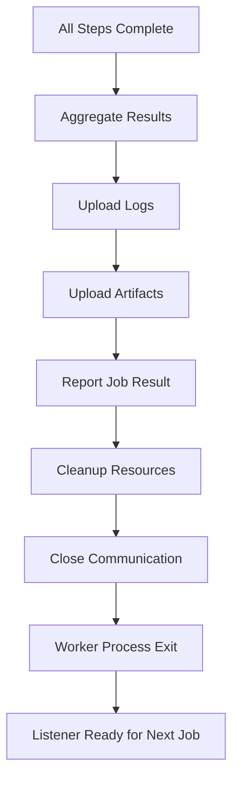
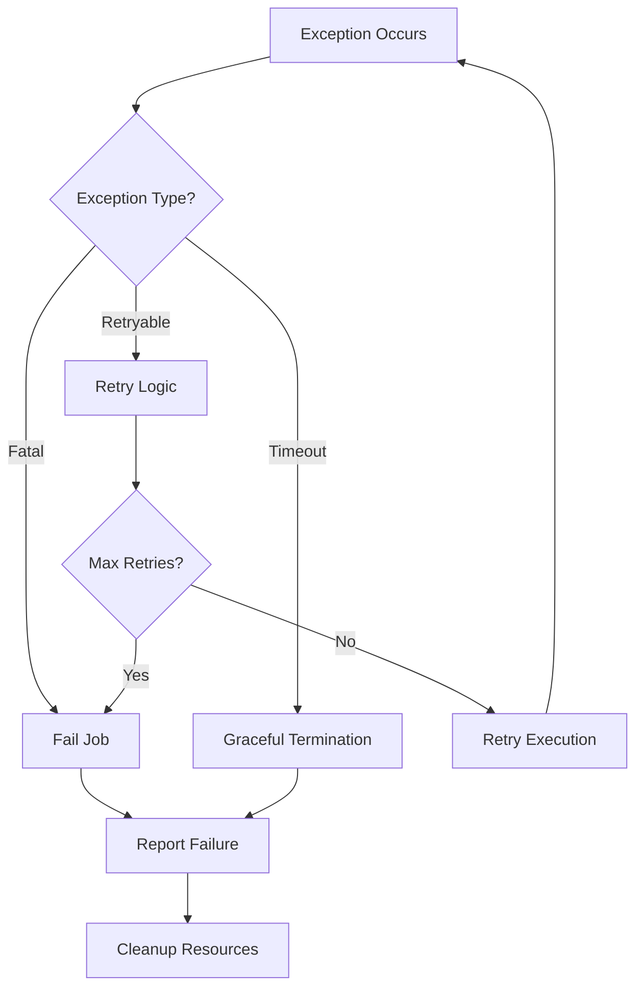

# Agent Lifecycle Flow

This page provides a comprehensive overview of the Azure DevOps Agent execution flow from startup to job completion.

## 🔄 Complete Execution Flow

### Phase 1: Agent Startup & Initialization



**Key Components:**
- `Agent.Listener/Program.cs::Main()` - Entry point
- Service locator initialization
- Azure DevOps authentication setup
- Capability advertisement

### Phase 2: Job Reception & Worker Creation



**Key Components:**
- `JobDispatcher.cs` - Job routing and worker creation
- IPC pipe establishment
- Job message serialization/transfer

### Phase 3: Worker Initialization



**Key Components:**
- `Agent.Worker/Program.cs::Main()` - Worker entry point
- `Worker.cs::RunAsync()` - Main worker orchestration
- Secret masking initialization
- Communication channel setup

### Phase 4: Job Execution Setup



**Key Components:**
- `JobRunner.cs::RunAsync()` - Job orchestration
- Variable expansion and secret masking
- Working directory setup
- Environment preparation

### Phase 5: Step Processing



**Key Components:**
- `StepsRunner.cs` - Step orchestration
- `TaskRunner.cs` - Task execution
- Result collection and reporting

### Phase 6: Task Execution Deep Dive



**Key Components:**
- Input parameter processing
- Handler creation and execution
- Output capture and result reporting

### Phase 7: Job Completion & Cleanup



**Key Components:**
- Result aggregation
- Log and artifact upload
- Resource cleanup
- Process termination

## 📊 Detailed Phase Breakdown

### 1. Agent Listener Lifecycle

```
Agent.Listener Process (Persistent)
├── Startup
│   ├── Configuration loading
│   ├── Service registration
│   └── Authentication setup
├── Runtime Loop
│   ├── Job message polling
│   ├── Worker process creation
│   ├── Communication management
│   └── Health monitoring
└── Shutdown
    ├── Graceful worker termination
    ├── Resource cleanup
    └── Process exit
```

**Duration**: Continuous (until explicitly stopped)  
**Memory**: ~50-100MB baseline  
**CPU**: Low (polling intervals)

### 2. Job Dispatcher Operations

```
JobDispatcher (Per Job)
├── Job Validation
│   ├── Agent capability matching
│   ├── Resource availability check
│   └── Security validation
├── Worker Creation
│   ├── Process spawning
│   ├── IPC setup
│   └── Message transfer
└── Monitoring
    ├── Worker health checks
    ├── Timeout management
    └── Error handling
```

**Duration**: Seconds to minutes  
**Memory**: Minimal overhead  
**CPU**: Process creation burst

### 3. Worker Process Lifecycle

```
Agent.Worker Process (Per Job)
├── Initialization (0-30 seconds)
│   ├── Service container setup
│   ├── Communication establishment
│   ├── Job message processing
│   └── Context preparation
├── Execution (Variable duration)
│   ├── Step processing
│   ├── Task execution
│   ├── Output collection
│   └── Progress reporting
└── Cleanup (0-10 seconds)
    ├── Result finalization
    ├── Upload operations
    ├── Resource cleanup
    └── Process termination
```

**Duration**: Job-dependent (minutes to hours)  
**Memory**: 100MB-2GB+ (depends on tasks)  
**CPU**: Variable (task-dependent)

## 🔍 Critical Path Analysis

### Performance Bottlenecks

1. **Worker Startup** (0-30 seconds)
   - Service container initialization
   - Communication channel establishment
   - Job message deserialization

2. **Task Input Processing** (1-10 seconds per task)
   - Variable expansion
   - Secret masking
   - File path resolution

3. **Task Execution** (Variable)
   - Handler creation
   - Process spawning
   - I/O operations

4. **Result Upload** (5-60 seconds)
   - Log file upload
   - Artifact upload
   - Network latency

### Optimization Opportunities

- **Parallel Processing**: Multiple tasks within jobs
- **Caching**: Handler and tool caching
- **Compression**: Log and artifact compression
- **Batching**: Result upload batching

## 🛡️ Security Checkpoints

### Throughout Execution

1. **Agent Authentication** (Phase 1)
   - PAT validation
   - Certificate verification
   - Capability-based access

2. **Job Validation** (Phase 2)
   - Permission verification
   - Resource availability
   - Security policy compliance

3. **Secret Management** (Phase 3-6)
   - Variable masking
   - Output sanitization
   - Secure communication

4. **Resource Isolation** (Phase 3-7)
   - Process boundaries
   - File system isolation
   - Network restrictions

## 📈 Monitoring Points

### Key Metrics Collected

| Phase | Metric | Purpose |
|-------|---------|---------|
| Startup | Agent initialization time | Performance monitoring |
| Job Reception | Queue time | Resource utilization |
| Worker Creation | Process spawn time | System performance |
| Job Execution | Task duration | Pipeline optimization |
| Cleanup | Upload time | Network performance |

### Performance Counters

```csharp
// Key performance markers in code
HostContext.WritePerfCounter("WorkerWaitingForJobMessage");
HostContext.WritePerfCounter($"WorkerJobMessageReceived_{jobMessage.RequestId}");
HostContext.WritePerfCounter($"JobStarted_{jobMessage.JobId}");
HostContext.WritePerfCounter($"JobCompleted_{jobMessage.JobId}");
```

## 🚨 Error Handling Flow

### Exception Management



### Recovery Mechanisms

1. **Connection Failures**: Automatic reconnection with exponential backoff
2. **Task Failures**: Continue with next steps unless fatal
3. **Resource Exhaustion**: Graceful degradation and cleanup
4. **Process Crashes**: Worker restart and job retry

## 🔄 State Transitions

### Job State Machine

```
[Queued] → [Running] → [Completed]
    ↓         ↓           ↑
[Canceled] ← [Failed] ←──┘
```

### Worker State Machine

```
[Created] → [Initializing] → [Running] → [Completing] → [Terminated]
    ↓            ↓             ↓            ↓
[Failed] ←───────┴─────────────┴────────────┘
```

## 🎯 Next Steps

For deeper understanding:

1. **[Process Architecture](./Process-Architecture.md)** - Inter-process communication details
2. **[Component Reference](./Component-Reference.md)** - Individual component documentation
3. **[Security Implementation](./Security-Implementation.md)** - Security feature deep dive
4. **[Performance Monitoring](./Performance-Monitoring.md)** - Metrics and optimization

---

**Key Insights:**
- Multi-phase execution with clear boundaries
- Comprehensive error handling at each phase
- Security validation throughout the lifecycle
- Performance monitoring at critical points
