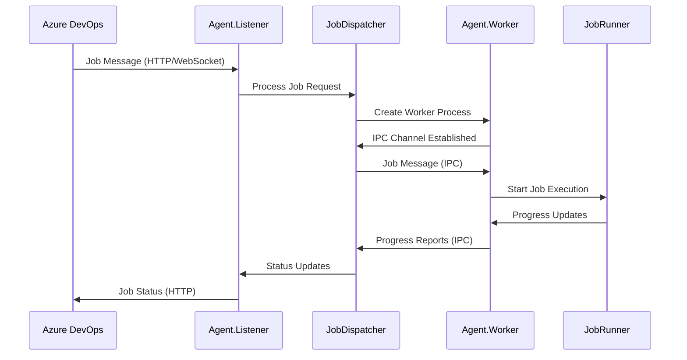
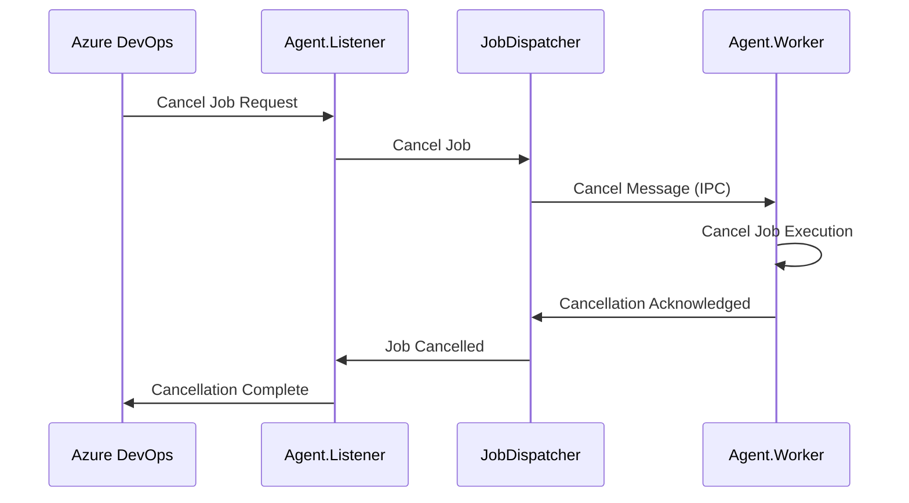

# Process Architecture

The Azure DevOps Agent uses a sophisticated multi-process architecture designed for reliability, security, and scalability. This page provides detailed technical information about how processes communicate and coordinate.

## 🏗️ Multi-Process Design

### Architecture Overview

```
┌─────────────────────────────────────────────────────────────────┐
│                           Host System                            │
├─────────────────────────────────────────────────────────────────┤
│                                                                 │
│  ┌─────────────────────┐           ┌─────────────────────┐      │
│  │   Agent.Listener    │    IPC    │   Agent.Worker      │      │
│  │   (Persistent)      │ ◄────────► │   (Per Job)        │      │
│  │                     │   Pipes   │                     │      │
│  │ ┌─────────────────┐ │           │ ┌─────────────────┐ │      │
│  │ │ JobDispatcher   │ │           │ │ JobRunner       │ │      │
│  │ └─────────────────┘ │           │ └─────────────────┘ │      │
│  │ ┌─────────────────┐ │           │ ┌─────────────────┐ │      │
│  │ │ MessageListener │ │           │ │ StepsRunner     │ │      │
│  │ └─────────────────┘ │           │ └─────────────────┘ │      │
│  │ ┌─────────────────┐ │           │ ┌─────────────────┐ │      │
│  │ │ AgentServer     │ │           │ │ TaskRunner(s)   │ │      │
│  │ └─────────────────┘ │           │ └─────────────────┘ │      │
│  └─────────────────────┘           └─────────────────────┘      │
│           │                                   │                 │
│           ▼                                   ▼                 │
│  ┌─────────────────────┐           ┌─────────────────────┐      │
│  │ Azure DevOps        │           │ Local File System  │      │
│  │ Services            │           │ & External Tools   │      │
│  └─────────────────────┘           └─────────────────────┘      │
│                                                                 │
└─────────────────────────────────────────────────────────────────┘
```

## 🔄 Process Relationships

### 1:1 vs 1:N Analysis

| Component A | Relationship | Component B | Rationale |
|-------------|--------------|-------------|-----------|
| **Agent** | 1:1 | **JobDispatcher** | Single dispatcher per agent instance |
| **JobDispatcher** | 1:1 | **Worker Process** | Process isolation per job |
| **Worker** | 1:1 | **JobRunner** | Single job orchestrator per worker |
| **JobRunner** | 1:1 | **StepsRunner** | Single step coordinator per job |
| **StepsRunner** | 1:N | **TaskRunner** | Multiple tasks per job possible |
| **Agent** | 1:N | **Jobs Over Time** | Sequential job processing |

### Why 1:1 Job-to-Worker?

**Benefits:**
- **Process Isolation**: Complete memory and resource isolation
- **Security**: Job secrets isolated from other jobs
- **Reliability**: Job failures don't affect other jobs
- **Resource Management**: Clear resource boundaries
- **Debugging**: Easier to trace job-specific issues

**Trade-offs:**
- **Performance**: Process creation overhead
- **Memory**: Higher baseline memory usage
- **Complexity**: IPC communication required

## 📡 Inter-Process Communication (IPC)

### Communication Channel Design

```csharp
// Core IPC implementation
public interface IProcessChannel : IDisposable
{
    void StartClient(string pipeNameIn, string pipeNameOut);
    void StartServer(Action<WorkerMessage> messageReceived);
    Task<WorkerMessage> ReceiveAsync(CancellationToken cancellationToken);
    Task SendAsync(MessageType messageType, string body, CancellationToken cancellationToken);
}
```

### Message Flow Patterns

#### 1. Job Initiation Flow



#### 2. Cancellation Flow



### Message Types

```csharp
public enum MessageType
{
    NewJobRequest,           // Listener → Worker: Start new job
    CancelRequest,           // Listener → Worker: Cancel current job
    AgentShutdown,          // Listener → Worker: Agent shutting down
    OperatingSystemShutdown, // Listener → Worker: OS shutdown
    JobMetadataUpdate,      // Listener → Worker: Update job metadata
    JobCompleted,           // Worker → Listener: Job finished
    JobProgress             // Worker → Listener: Progress update
}
```

### IPC Implementation Details

#### Named Pipes (Windows)
```csharp
// Pipe creation pattern
var pipeNameIn = $"vsts_agent_pipe_{processId}_in";
var pipeNameOut = $"vsts_agent_pipe_{processId}_out";

// Security: Process-specific pipe names prevent interference
```

#### Unix Domain Sockets (Linux/macOS)
```csharp
// Socket path pattern  
var socketPath = $"/tmp/vsts_agent_socket_{processId}";

// Cleanup: Automatic socket cleanup on process termination
```

## 🔐 Security Architecture

### Process Isolation Benefits

#### Memory Isolation
- **Separate Address Spaces**: Jobs cannot access each other's memory
- **Stack Protection**: Independent call stacks per job
- **Heap Isolation**: No shared memory between jobs

#### File System Isolation
- **Working Directories**: Each job gets isolated working directory
- **Temporary Files**: Job-specific temp directory cleanup
- **Path Sandboxing**: Restricted file system access

#### Network Isolation
- **Process-Level Controls**: Network access controls per process
- **Certificate Stores**: Isolated certificate management
- **Proxy Settings**: Per-job proxy configuration

### Secret Management

#### Multi-Layer Secret Masking

```csharp
// Layer 1: Variable-level masking
foreach (var variable in jobMessage.Variables)
{
    if (variable.Value.IsSecret)
    {
        HostContext.SecretMasker.AddValue(variable.Value.Value, "Variable");
    }
}

// Layer 2: Endpoint masking
foreach (var endpoint in jobMessage.Resources.Endpoints)
{
    foreach (var auth in endpoint.Authorization.Parameters)
    {
        if (MaskingUtil.IsEndpointAuthorizationParametersSecret(auth.Key))
        {
            HostContext.SecretMasker.AddValue(auth.Value, "Endpoint");
        }
    }
}

// Layer 3: Dynamic masking
HostContext.SecretMasker.AddRegex(maskPattern, "DynamicSecret");
```

#### Cross-Process Secret Protection
- **No Secret Sharing**: Secrets never cross process boundaries in plain text
- **Masked Logging**: All logs automatically masked before IPC
- **Memory Scrubbing**: Sensitive data cleared from memory on cleanup

## ⚡ Performance Characteristics

### Process Creation Overhead

| Phase | Duration | Description |
|-------|----------|-------------|
| **Process Spawn** | 50-200ms | OS process creation |
| **Service Init** | 100-500ms | Dependency injection setup |
| **IPC Establishment** | 10-50ms | Communication channel setup |
| **Job Message Transfer** | 5-20ms | Job data serialization/transfer |
| **Context Setup** | 50-200ms | Variables, environment, working directory |

### Memory Usage Patterns

```
Agent.Listener (Persistent):
├── Baseline: ~50-100MB
├── Per Connection: +5-10MB
└── Peak During Job Dispatch: +20-50MB

Agent.Worker (Per Job):
├── Baseline: ~100-200MB
├── Per Task: +10-50MB
├── Large Jobs: 500MB-2GB+
└── Memory Cleanup: 95%+ reclaimed on exit
```

### Optimization Strategies

#### Process Pooling (Not Used - Why?)
- **Security**: Would break process isolation
- **Complexity**: State cleanup between jobs too complex
- **Resource Management**: Harder to track resource usage
- **Debugging**: Harder to isolate job-specific issues

#### Communication Optimization
- **Message Batching**: Multiple small messages combined
- **Compression**: Large messages compressed before transfer
- **Streaming**: Large artifacts streamed rather than buffered
- **Async Patterns**: Non-blocking communication throughout

## 🔧 Configuration & Management

### Process Configuration

#### Environment Variables
```csharp
// Shared environment
AGENT_VERSION=3.x.x
AGENT_OS=Windows_NT
AGENT_ARCHITECTURE=X64

// Process-specific
WORKER_PROCESS_ID=12345
JOB_ID=abc-def-ghi
AGENT_TEMP_FOLDER=C:\Agents\Agent01\_work\_temp
```

#### Command Line Arguments
```bash
# Worker process invocation
Agent.Worker.exe 
  --pipeIn "pipe_name_in"
  --pipeOut "pipe_name_out" 
  --jobId "12345"
  --requestId "67890"
```

### Monitoring & Diagnostics

#### Process Health Monitoring

```csharp
// Health check pattern
public class ProcessHealthMonitor
{
    public async Task<HealthStatus> CheckWorkerHealth(int processId)
    {
        var process = Process.GetProcessById(processId);
        return new HealthStatus
        {
            IsResponding = process.Responding,
            MemoryUsage = process.WorkingSet64,
            CpuTime = process.TotalProcessorTime,
            ThreadCount = process.Threads.Count
        };
    }
}
```

#### Performance Counters

```csharp
// Key metrics collected
HostContext.WritePerfCounter("WorkerProcessCreated");
HostContext.WritePerfCounter("IPCChannelEstablished");
HostContext.WritePerfCounter("JobMessageTransferred");
HostContext.WritePerfCounter("WorkerProcessExited");
```

## 🚨 Error Handling & Recovery

### Process Failure Scenarios

#### Worker Process Crash
```csharp
// Detection and recovery
public async Task HandleWorkerCrash(int processId, Guid jobId)
{
    // 1. Detect crash
    var process = await GetWorkerProcess(processId);
    if (process.HasExited)
    {
        // 2. Log crash details
        Trace.Error($"Worker process {processId} crashed with exit code {process.ExitCode}");
        
        // 3. Report job failure
        await ReportJobFailure(jobId, "Worker process crashed");
        
        // 4. Cleanup resources
        await CleanupWorkerResources(processId);
        
        // 5. Prepare for next job
        await PrepareForNextJob();
    }
}
```

#### Communication Failures
- **Timeout Handling**: Configurable timeouts with retry logic
- **Connection Recovery**: Automatic reconnection attempts
- **Graceful Degradation**: Fallback to basic communication modes

#### Resource Exhaustion
- **Memory Monitoring**: Automatic worker termination on memory exhaustion
- **Disk Space**: Job termination on insufficient disk space
- **Network Issues**: Retry with exponential backoff

### Recovery Strategies

#### Automatic Recovery
```csharp
// Retry pattern for transient failures
public async Task<T> RetryOperation<T>(Func<Task<T>> operation, int maxRetries = 3)
{
    for (int attempt = 1; attempt <= maxRetries; attempt++)
    {
        try
        {
            return await operation();
        }
        catch (Exception ex) when (IsRetryableException(ex) && attempt < maxRetries)
        {
            var delay = TimeSpan.FromSeconds(Math.Pow(2, attempt)); // Exponential backoff
            await Task.Delay(delay);
            Trace.Warning($"Retry attempt {attempt} after {delay.TotalSeconds}s: {ex.Message}");
        }
    }
    throw new Exception($"Operation failed after {maxRetries} attempts");
}
```

## 🎯 Best Practices

### IPC Communication
1. **Always Use Timeouts**: Prevent indefinite blocking
2. **Handle Cancellation**: Respect cancellation tokens
3. **Validate Messages**: Verify message integrity
4. **Cleanup Resources**: Proper disposal of communication channels

### Process Management
1. **Monitor Process Health**: Regular health checks
2. **Graceful Shutdown**: Clean termination sequences
3. **Resource Cleanup**: Automatic cleanup on process exit
4. **Error Reporting**: Comprehensive error logging

### Security
1. **Validate Process Identity**: Ensure communication with correct process
2. **Secure Channels**: Use authenticated communication where possible
3. **Minimize Privileges**: Run with least required privileges
4. **Audit Trail**: Log all inter-process communications

## 🔄 Next Steps

To learn more about specific aspects:

1. **[Component Reference](./Component-Reference.md)** - Detailed component documentation
2. **[Security Implementation](./Security-Implementation.md)** - Security features and protocols
3. **[Performance Monitoring](./Performance-Monitoring.md)** - Metrics and optimization
4. **[Troubleshooting Guide](./Troubleshooting-Guide.md)** - Common issues and solutions

---

**Key Takeaways:**
- Process isolation provides security and reliability at the cost of overhead
- IPC communication is robust with comprehensive error handling
- Architecture supports sequential job processing with complete isolation
- Performance characteristics are well-understood and optimized
